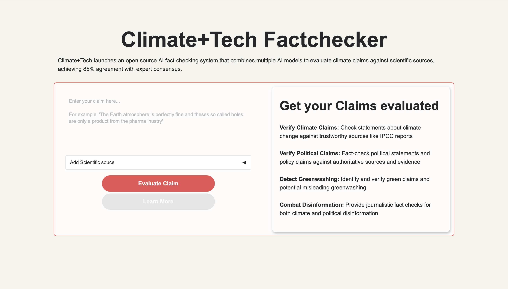
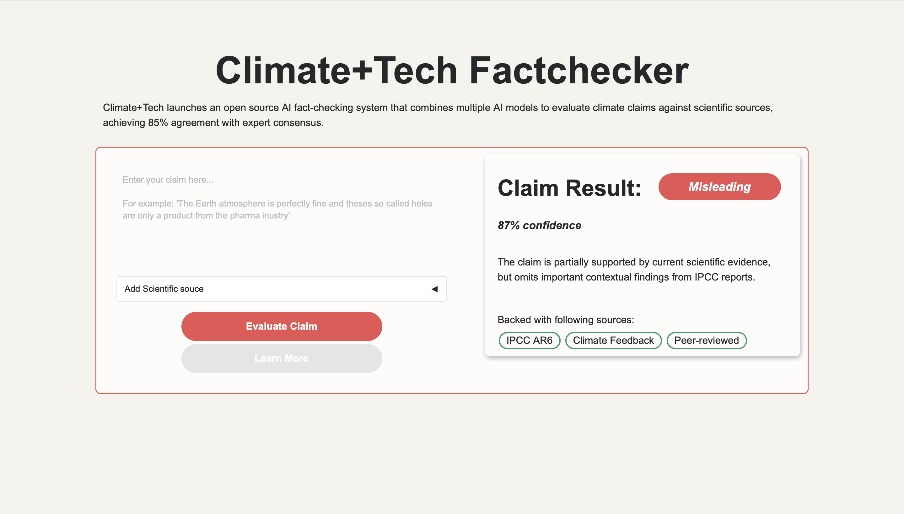

# Climate+Tech FactChecker UI Prototype

## Overview

- Gradio-based prototype
- custom Blocks layout
- branded Climate+Tech styling
- local Ollama integration planned

## Goals
- improve usability
- create clearer claim evaluation workflow
- make fact-checking outputs easier to understand

## Features
- custom Gradio layout
- responsive card-based UI
- styled verdict/result cards
- evidence chips/tags
- source input accordion
- claim validation workflow

## UI / Screenshots
- UI_Screenshoot_1

- UI_Screenshoot_2

## Design Decisions
- card-based layout
- visual hierarchy
- verdict emphasis
- responsive spacing
- adapted Climate+Tech branding

## Tech Stack
- Python
- Gradio
- CSS customization
- Ollama

## Future Improvements
- [ ] real-time evidence retrieval
- [ ] live LLM integration
- [ ] loading states
- [ ] source ranking
- [ ] interactive evidence tables